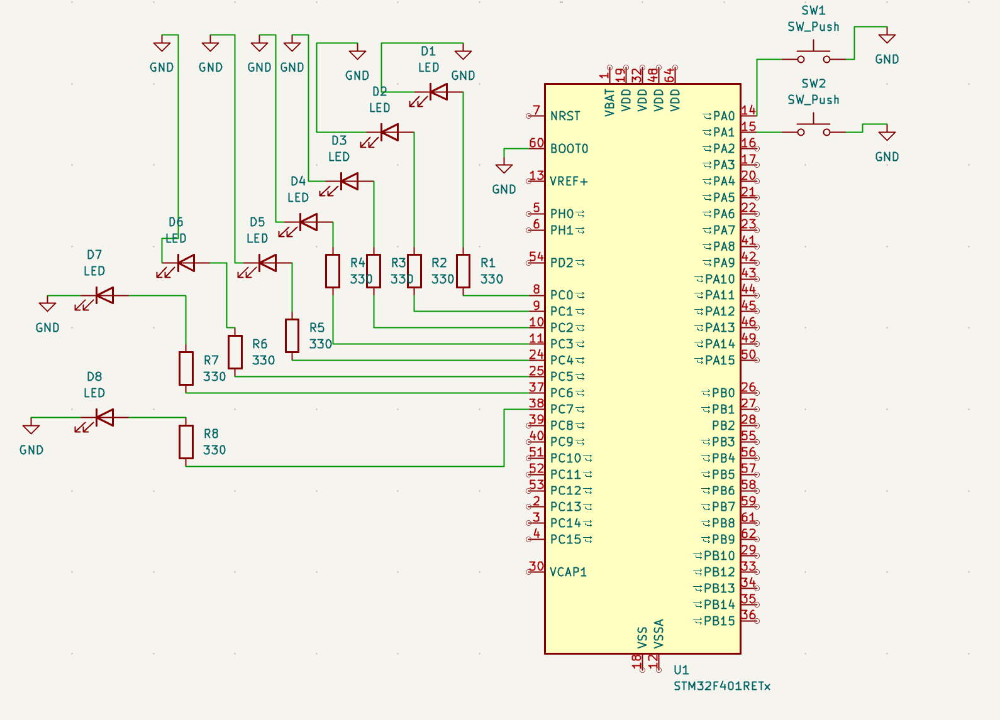
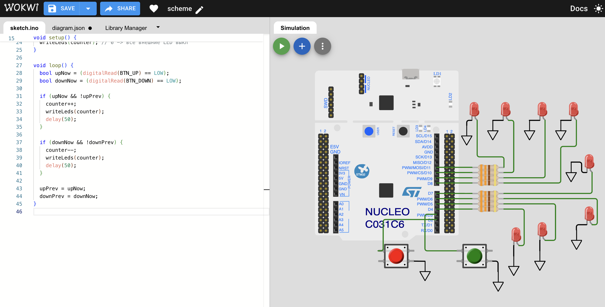

# Laboratory Work 1

## Course
Microcontroller Systems

## Title
Buttons and LED Counter (8-bit Representation)

## Objective
To implement a microcontroller-based 8-bit up/down counter controlled by two push-buttons and displayed on eight LEDs.

## Task Requirements
1. Build a circuit with a microcontroller, two buttons (`UP`, `DOWN`), and 8 LEDs.
2. Implement firmware so that:
   - initial state is all LEDs OFF,
   - `UP` increases the 8-bit value,
   - `DOWN` decreases the 8-bit value,
   - LEDs represent the current value in binary form.

## Circuit Diagram
The circuit was assembled according to the assignment structure (microcontroller + 2 buttons + 8 LEDs).



## Software Implementation
Main source file:
- `Lab1_main.c`

Firmware logic:
1. Configure two button inputs with pull-up behavior.
2. Configure eight LED outputs.
3. Store current 8-bit value in a counter variable.
4. Detect button press edges and increment/decrement the counter.
5. Output counter bits to 8 LED lines.

## Runtime Verification
Initial state (counter = 0):



Counter operation after button presses:


Observed behavior:
1. At startup all external LEDs are OFF.
2. Pressing `UP` increases the binary value shown on LEDs.
3. Pressing `DOWN` decreases the binary value shown on LEDs.
4. The counter operates as an 8-bit value (0..255 with wrap-around).

## Code Listing (`main.c`)
```c
#include "stm32f4xx.h"
#include <stdint.h>

#define LED_MASK_8BIT   (0xFFu)
#define BTN_UP_PIN      (0u)   // PA0
#define BTN_DOWN_PIN    (1u)   // PA1

static void delay_cycles(volatile uint32_t n)
{
    while (n--) {
        __NOP();
    }
}

static void gpio_init(void)
{
    // Enable GPIOA and GPIOC clocks.
    RCC->AHB1ENR |= RCC_AHB1ENR_GPIOAEN | RCC_AHB1ENR_GPIOCEN;
    (void)RCC->AHB1ENR;

    // PC0..PC7 as outputs (LEDs), push-pull, no pull.
    GPIOC->MODER &= ~(0xFFFFu);
    GPIOC->MODER |=  (0x5555u);
    GPIOC->OTYPER &= ~(LED_MASK_8BIT);
    GPIOC->PUPDR  &= ~(0xFFFFu);

    // PA0 (UP) and PA1 (DOWN) as input with pull-up.
    GPIOA->MODER &= ~((3u << (BTN_UP_PIN * 2u)) | (3u << (BTN_DOWN_PIN * 2u)));
    GPIOA->PUPDR &= ~((3u << (BTN_UP_PIN * 2u)) | (3u << (BTN_DOWN_PIN * 2u)));
    GPIOA->PUPDR |=  ((1u << (BTN_UP_PIN * 2u)) | (1u << (BTN_DOWN_PIN * 2u)));
}

static void leds_write(uint8_t value)
{
    uint32_t odr = GPIOC->ODR;
    odr &= ~LED_MASK_8BIT;
    odr |= value;
    GPIOC->ODR = odr;
}

static uint8_t button_pressed(uint32_t pin)
{
    // Active low because pull-up is enabled.
    return ((GPIOA->IDR & (1u << pin)) == 0u) ? 1u : 0u;
}

int main(void)
{
    uint8_t counter = 0u;
    uint8_t up_prev = 0u;
    uint8_t down_prev = 0u;

    gpio_init();
    leds_write(counter); // Initial state: all LEDs off.

    for (;;) {
        uint8_t up_now = button_pressed(BTN_UP_PIN);
        uint8_t down_now = button_pressed(BTN_DOWN_PIN);

        if ((up_now != 0u) && (up_prev == 0u)) {
            counter++;
            leds_write(counter);
            delay_cycles(120000u); // Debounce delay.
        }

        if ((down_now != 0u) && (down_prev == 0u)) {
            counter--;
            leds_write(counter);
            delay_cycles(120000u); // Debounce delay.
        }

        up_prev = up_now;
        down_prev = down_now;
    }
}
```

## Conclusion
The laboratory task was completed successfully. The hardware structure and firmware behavior match the required functionality: 8-bit LED indication controlled by `UP` and `DOWN` buttons.
