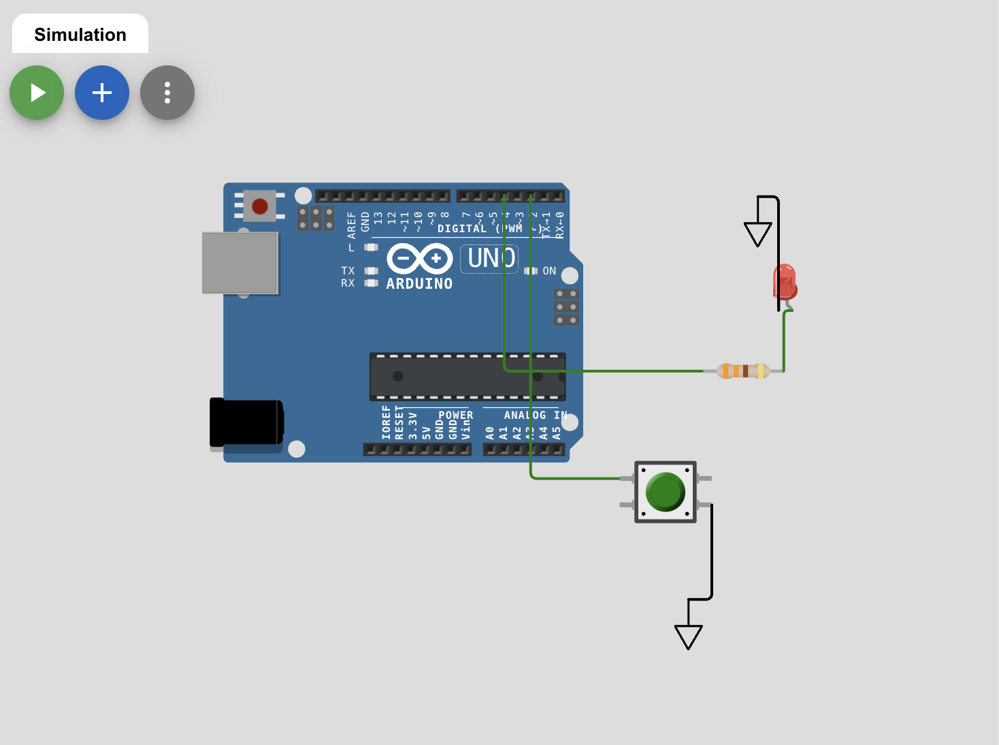
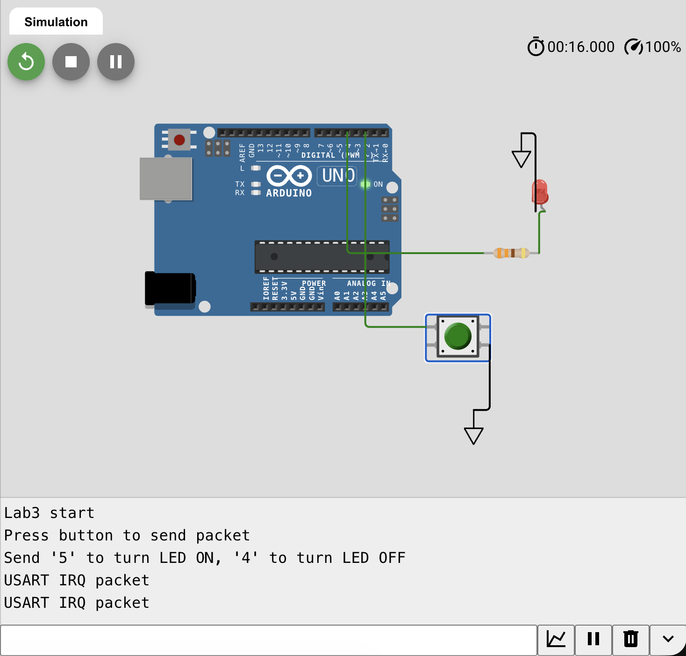
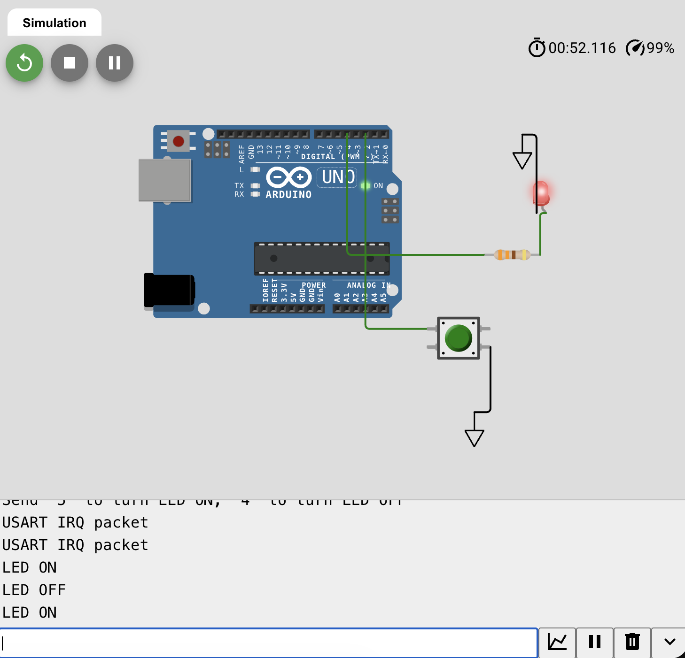

# Laboratory Work 3

## Course
Microcontroller Systems

## Title
USART Communication with TX/RX Handling and LED Control

## Objective
To extend the previous project with USART packet transmission on button press and byte reception for LED control according to variant rules.

## Variant
Variant: **5**

RX command mapping:
- `4` -> LED OFF
- `5` -> LED ON

## Task Requirements and Implementation
1. **Send function for byte packet**: implemented as `sendPacketIRQStyle()`.
2. **Transmit flow with TXE-like behavior**: byte-by-byte transmission is performed in software loop (functional simulation analogue).
3. **Button-triggered sending**: pushbutton on digital pin `2` launches packet transmission.
4. **RX processing**: received byte is checked and LED on digital pin `4` is switched ON/OFF for variant values.

## Circuit / Simulation Setup
Functional simulation setup was implemented in Wokwi:
- Controller board: Arduino Uno (used as simulation analogue due stable UART terminal support in Wokwi).
- Pushbutton: `D2` to GND (active low with internal pull-up).
- LED line: `D4 -> R(330 Ohm) -> LED -> GND`.
- UART terminal: built-in Serial Monitor (`9600` baud).

Schematic screenshot:



## Runtime Verification
TX packet after button press:



RX command processing and LED control:



Observed behavior:
1. On startup, Serial terminal prints initialization text.
2. Button press sends packet `USART IRQ packet`.
3. Entering `5` in terminal turns LED ON.
4. Entering `4` in terminal turns LED OFF.

## Calculations
USART baud in simulation:
- Configured baud rate: `9600` bps.
- Terminal baud rate: `9600` bps.
- Baud mismatch in this setup: `0%`.

Variant logic check:
- Task table for variant 5: `4-off, 5-on`.
- Implemented mapping matches the task.

## Code Listing (`Wokwi_Lab3_sketch.ino`)
```cpp
const int BTN_SEND = 2;
const int LED_CTRL = 4;

const char CMD_OFF = '4';
const char CMD_ON  = '5';

bool btnPrev = false;

void setup() {
  pinMode(BTN_SEND, INPUT_PULLUP);
  pinMode(LED_CTRL, OUTPUT);
  digitalWrite(LED_CTRL, LOW);

  Serial.begin(9600);
  delay(500);
  Serial.println("Lab3 start");
  Serial.println("Press button to send packet");
  Serial.println("Send '5' to turn LED ON, '4' to turn LED OFF");
}

void sendPacketIRQStyle(const char *s) {
  while (*s) {
    Serial.write(*s++);
    delay(1);
  }
}

void loop() {
  bool btnNow = (digitalRead(BTN_SEND) == LOW);

  if (btnNow && !btnPrev) {
    sendPacketIRQStyle("USART IRQ packet\\r\\n");
  }
  btnPrev = btnNow;

  while (Serial.available() > 0) {
    char rx = (char)Serial.read();

    if (rx == CMD_ON) {
      digitalWrite(LED_CTRL, HIGH);
      Serial.println("LED ON");
    } else if (rx == CMD_OFF) {
      digitalWrite(LED_CTRL, LOW);
      Serial.println("LED OFF");
    }
  }
}
```

Additional microcontroller implementation file (STM32 source used in project structure):
- `Lab3_main.c`

## Conclusion
Laboratory work 3 was completed. Packet transmission on button press and receive-based LED control were implemented and verified. Variant 5 conditions (`4`/`5`) are fully satisfied.
